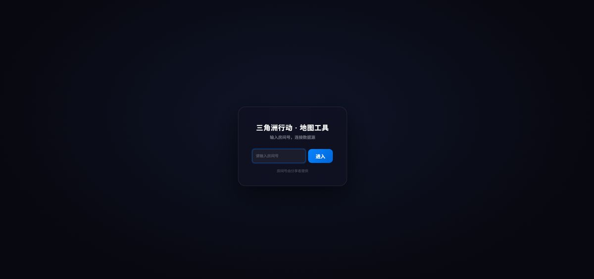
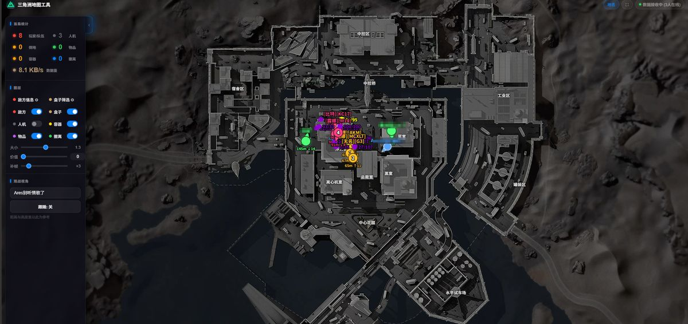
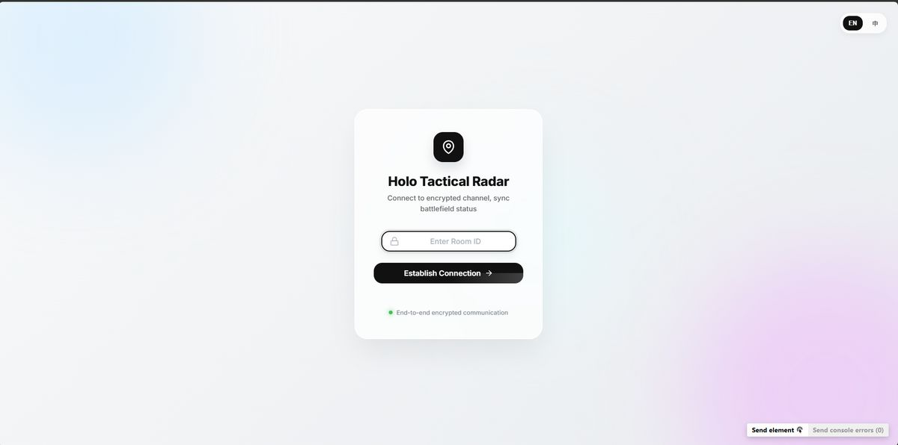
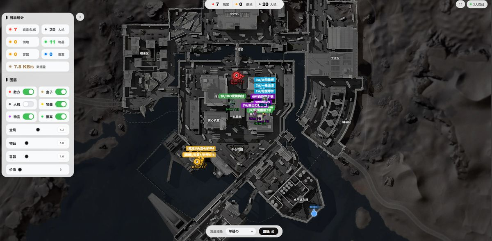
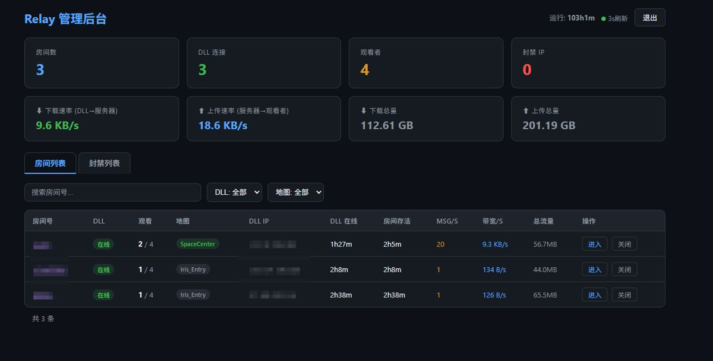
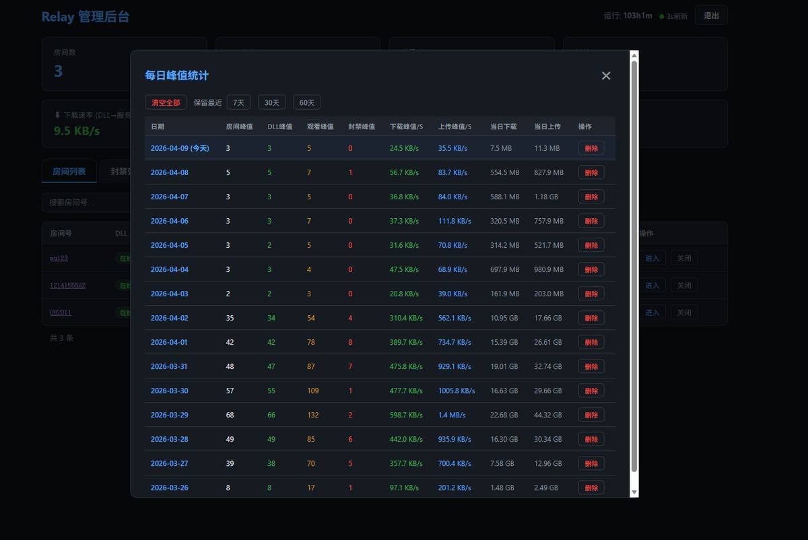

# 🎯 Delta Force Radar — 实时地图工具

《三角洲行动》烽火地带实时互动地图，支持多人观战、WebSocket 中继转发。

本仓库包含 **两套主题风格**（黑色 / 白色），均为完整的前端 + 后端。

---

## 📸 效果预览

### 🖤 暗色主题 (Dark Theme)

| 登录页 | 对局中 |
|:---:|:---:|
|  |  |

### 🤍 浅色主题 (Light Theme)

| 登录页 | 对局中 |
|:---:|:---:|
|  |  |

### 🔧 管理后台 (Admin Dashboard，两套通用)

| 房间列表 & 实时数据 | 每日峰值统计 |
|:---:|:---:|
|  |  |

---

## 📁 项目结构

```
├── 黑色前端后端/              # 暗色主题版本
│   ├── radar_backend/        # 后端 — WebSocket Relay 服务器
│   │   └── radar-relay/
│   │       ├── relay.js      # 主服务（WS 转发 + 管理后台 API）
│   │       ├── admin.html    # 管理后台前端页面
│   │       ├── ecosystem.config.js  # PM2 部署配置
│   │       └── .env.example  # 环境变量模板
│   └── radar_frontend/       # 前端 — 互动地图页面
│       └── radar/
│           ├── index.html    # 地图主页面（含入口页）
│           ├── styles.css    # 样式
│           └── js/           # 模块化 JS
│               ├── mapConfig.js      # 地图配置与游戏常量
│               ├── mapEngine.js      # Leaflet 地图引擎
│               ├── canvasRenderer.js # Canvas 实体渲染
│               ├── wsClient.js       # WebSocket 客户端
│               ├── ui.js             # UI 交互逻辑
│               └── main.js           # 启动入口
│
├── 白色前端后端/              # 浅色主题版本（含炫酷入场动画）
│   ├── radar_backend/        # 后端（同上）
│   │   └── radar-relay/
│   │       ├── relay.js
│   │       ├── admin.html
│   │       ├── ecosystem.config.js
│   │       ├── push_rooms.sh # 房间白名单推送脚本
│   │       └── .env.example
│   └── radar_frontend/       # 前端
│       └── radar/
│           ├── landing.html  # 独立入场页面（毛玻璃动效）
│           ├── index.html    # 地图主页面（含入口逻辑）
│           ├── map.html      # 地图页面
│           ├── styles.css
│           └── js/           # 模块化 JS（同上）
```

## ✨ 功能特性

- **实时雷达** — DLL 端采集游戏数据，通过 WebSocket 实时推送到地图
- **多人观战** — 一个房间最多 4 人同时观看，通过中继服务器转发
- **50ms 节流** — 服务端智能节流，防止突发数据卡顿
- **管理后台** — 实时查看房间状态、流量统计、IP 封禁管理
- **反滥用系统** — 认证限流 + 发布限流 + 渐进封禁
- **每日统计** — SQLite 持久化存储每日峰值、流量等历史数据
- **房间白名单** — 支持拉取模式 / 推送模式控制允许的房间
- **5 张地图** — 零号大坝、长弓溪谷、航天基地、巴克什、潮汐监狱
- **自动切换** — 根据游戏数据自动切换到对应地图

---

## 🚀 快速部署

### 环境要求

- **Node.js** >= 18
- **npm**
- **PM2**（可选，用于生产环境进程管理）
- 一台公网服务器（或本地测试）

### 1. 后端部署

```bash
# 进入后端目录（以黑色版为例）
cd 黑色前端后端/radar_backend/radar-relay

# 安装依赖
npm install

# 复制环境变量模板并填写
cp .env.example .env
# 编辑 .env，填写你的管理员密码等配置

# 直接运行
node relay.js

# 或使用 PM2 运行（生产环境推荐）
pm2 start ecosystem.config.js
```

### 2. 前端部署

前端为纯静态文件，使用任意 Web 服务器（Nginx / Caddy / Apache）托管即可。

**Nginx 示例：**

```nginx
server {
    listen 1010;
    server_name _;
    root /path/to/radar_frontend/radar;
    index index.html;

    location / {
        try_files $uri $uri/ /index.html;
    }
}
```

### 3. 访问

- **地图页面** — `http://你的IP:1010/`
- **管理后台** — `http://你的IP:1377/`（用你设的 ADMIN_USER / ADMIN_PASS 登录）

---

## ⚙️ 环境变量说明

| 变量 | 默认值 | 说明 |
|---|---|---|
| `PORT` | `5000` | WebSocket 服务端口 |
| `ADMIN_PORT` | `1377` | 管理后台 HTTP 端口 |
| `ADMIN_USER` | `admin` | 管理后台用户名 |
| `ADMIN_PASS` | `changeme` | 管理后台密码（**必须修改**） |
| `ROOMS_API_URL` | 空 | 房间白名单拉取地址（留空则使用推送模式） |
| `ROOMS_API_BIND` | 空 | 拉取 API 时绑定的出口 IP（可选） |
| `ROOMS_SECRET` | `changeme` | 白名单推送接口密钥（**必须修改**） |

---

## 🔧 架构说明

```
┌──────────┐    WebSocket     ┌──────────────┐    WebSocket     ┌──────────┐
│  DLL端   │ ──── pub ──────> │  Relay 服务器 │ ──── sub ──────> │ 地图前端  │
│ (游戏内)  │    :5000        │  (relay.js)   │    :5000        │ (浏览器)  │
└──────────┘                  └──────┬───────┘                  └──────────┘
                                     │
                              HTTP API :1377
                                     │
                              ┌──────┴───────┐
                              │   管理后台     │
                              │ (admin.html)  │
                              └──────────────┘
```

- **DLL 端**（pub）：从游戏中采集实体数据，以 JSON/二进制压缩格式发送到 Relay
- **Relay 服务器**：认证 → 限流 → 50ms 节流 → 转发给所有订阅者
- **地图前端**（sub）：接收数据，在 Leaflet 地图上实时渲染玩家、物品、容器等
- **管理后台**：HTTP API + 静态页面，管理房间、封禁、统计

---

## � WebSocket 协议说明

### 连接地址

```
ws://你的服务器IP:5000
```

### 认证（连接后 5 秒内必须发送，否则被踢）

**DLL 端（数据发布者）：**
```json
{"action":"auth", "role":"pub", "key":"你的房间号"}
```

**网页端（观战者）：**
```json
{"action":"auth", "role":"sub", "key":"你的房间号"}
```

**认证响应：**
```json
{"ok":true, "role":"pub", "subs":2, "pub":true}
{"ok":false, "error":"房间号未授权"}
```

> 房间自动创建：第一个 `pub` 认证成功时房间即自动创建，无需手动操作。

### 数据传输规则

| 规则 | 说明 |
|---|---|
| 每房间 1 个 pub | 新 pub 会踢掉旧 pub |
| 每房间最多 4 个 sub | 超过返回错误 |
| 必须先发 mapName | 只有匹配已知游戏地图时才转发后续实体数据 |
| 50ms 节流 | 每个 sub 每 50ms 窗口最多收 5 条消息 |
| pub 限流 | 每秒最多 100 条，单条最大 500KB |
| 缓存机制 | 每种 type 缓存最新一条，新 sub 加入时推送缓存 |
| 支持压缩 | zlib deflate 二进制帧直接转发，前端自动解压 |

### DLL 端发送数据格式

DLL 端以 `pub` 角色连接后，持续发送以下 JSON 消息（支持 zlib 压缩二进制帧）：

**1. 地图名（必须先发，决定是否转发后续数据）：**
```json
{"type":"mapName", "data":"SpaceCenter_Level_XXX"}
```

有效地图前缀：`Dam_Iris_Level`(零号大坝)、`OLDCITY_LEVEL`(长弓溪谷)、`Forrest_Level`(航天基地)、`SpaceCenter_Level`(太空中心)、`Brakkesh_Level`(巴克什)、`Tide_Level`(潮汐监狱)

**2. 自身数据 (self)：**
```json
{"type":"self", "data":{"x":12345.0, "y":-9876.5, "z":500.0, "yw":180.5, "map":"SpaceCenter_Level_XXX", "n":"玩家名"}}
```

**3. 玩家列表 (players)：**
```json
{"type":"players", "data":[
  {"x":11000.0,"y":-8000.0,"z":450.0,"h":100,"mh":100,"t":3,"ai":0,"tm":0,"dn":0,"n":"玩家名","yw":90.0,"hl":3,"ar":4},
  {"x":9000.0,"y":-7000.0,"z":400.0,"h":80,"mh":100,"ai":1,"n":"人机名"}
]}
```

| 字段 | 说明 |
|---|---|
| `x, y, z` | UE 坐标（厘米） |
| `yw` | 朝向角度 |
| `h / mh` | 当前 / 最大血量 |
| `t` | 队伍 ID |
| `tm` | 是否队友 (1=是) |
| `ai` | 是否人机 (1=是) |
| `dn` | 是否倒地 (1=是) |
| `hl / ar` | 头盔 / 护甲等级 |

**4. 物品 (items)：**
```json
{"type":"items", "data":[
  {"x":10500.0,"y":-7500.0,"z":400.0,"n":"物品名","oid":"gun/ammo/5.56x45mm","v":15000,"q":4}
]}
```

**5. 容器 (containers)：**
```json
{"type":"containers", "data":[{"x":10200.0,"y":-7800.0,"z":400.0,"t":1}]}
```
> `t`: 1=保险箱, 2=小保险箱

**6. 撤离点 (exits)：**
```json
{"type":"exits", "data":[{"x":9000.0,"y":-6000.0,"z":300.0,"s":1}]}
```
> `s`: 1=安全撤离, 0=普通

**7. 死亡盒子 (boxes)：**
```json
{"type":"boxes", "data":[{"x":10800.0,"y":-7200.0,"z":400.0,"n":"玩家名","ai":0,"bt":1}]}
```

### DLL 端发送策略

| 数据 | 频率 | 压缩 |
|---|---|---|
| `mapName` | 地图切换时 | 不压缩（文本帧） |
| `self` | 每 100ms | zlib 压缩（>64B时） |
| `players` | 每 100ms | zlib 压缩 |
| `items / containers / exits / boxes` | 每 1.5s（增量，无变化不发） | zlib 压缩 |

### 数据流时序图

```
DLL端(pub)                     Relay(:5000)                    网页端(sub)
   │                              │                              │
   │── WS连接 ──────────────────→ │                              │
   │── {"action":"auth",          │                              │
   │    "role":"pub",             │                              │
   │    "key":"room123"} ───────→ │  创建房间 room123             │
   │←─ {"ok":true} ──────────────│                              │
   │                              │              WS连接 ─────────│
   │                              │←─ {"action":"auth",          │
   │                              │    "role":"sub",             │
   │                              │    "key":"room123"} ─────────│
   │                              │─→ {"ok":true,"pub":true} ──→│
   │                              │                              │
   │── mapName ─────────────────→ │──→ 立即转发 ───────────────→ │  切换地图
   │── self (每100ms) ──────────→ │──→ 50ms节流转发 ───────────→ │  绘制自身
   │── players (每100ms) ───────→ │──→ 50ms节流转发 ───────────→ │  绘制玩家
   │── items (每1.5s增量) ──────→ │──→ 节流转发 ───────────────→ │  绘制物品
```

---

## �📊 管理后台功能

- 实时查看所有活跃房间、在线人数
- 全局流量统计（上传/下载速率 + 历史累计）
- 每日峰值历史记录（最近 90 天）
- 单房间历史统计
- IP 封禁管理（自动 + 手动）
- 一键踢出房间 / 从后台直接进入观战

---

## 🎨 两套主题区别

| 特性 | 黑色版 | 白色版 |
|---|---|---|
| 主题风格 | 暗色系 | 浅色毛玻璃 |
| 入场页面 | 内嵌在 index.html | 独立 landing.html + 白屏转场动画 |
| 多语言 | 中文 | 中/英双语切换 |
| 房间推送脚本 | 无 | 含 push_rooms.sh |

---

## ⚠️ 安全提醒

1. **务必修改默认密码** — 部署前修改 `.env` 中的 `ADMIN_PASS` 和 `ROOMS_SECRET`
2. **不要将 `.env` 提交到 Git** — 已在 `.gitignore` 中排除
3. **建议使用反向代理** — 在 Relay 前面加 Nginx 反代，添加 HTTPS
4. **管理后台端口** — 建议限制为内网访问，或通过防火墙限制 IP

---

## 📝 License

MIT
